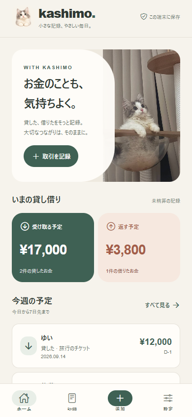
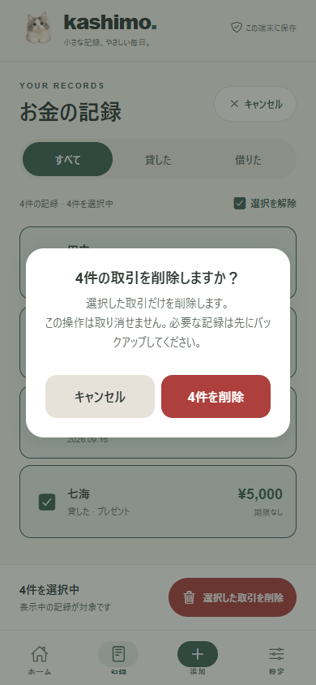

# Kashimo / カシモ

友だちとの貸し借りを、やさしく記録。AndroidアプリとiPhoneのホーム画面で使える、ローカル保存の貸し借り帳です。

## 1.1.1 の修正

Androidで下部タブのアイコンが細く切れたり、背景だけ表示されるレイアウトを修正しました。

- [最新版APK・ソースのダウンロード](https://github.com/specialMinority/kashimo/releases/tag/v1.1.1-preview)
- [原因とAndroid画面の比較](docs/ANDROID_TAB_FIX.md)

## 1.1 の変更

- 実際の猫の写真と、写真から生成したAIキャラクターを使った新デザイン。
- 記録の複数選択・表示中の全選択・一括削除。確認画面に削除件数を表示します。
- 削除の失敗時は記録と選択を維持。SQLiteはトランザクション、Webは一回の保存で更新します。
- iPhone向けアイコン・ホーム画面表示・オフライン起動を整備。
- 元の保存先・データ形式、登録・編集・精算完了/取消・JSONバックアップを維持。

## 使い方

Web: https://specialminority.github.io/kashimo/

iPhoneはSafariで開き、「共有」→「ホーム画面に追加」。初回のオンライン読み込みでアプリを保存した後はオフラインでも使えます。自動予約通知はAndroid用です。Webではアプリを開いて期限を確認します。

一括削除は「記録」→「選択」→取引を選ぶ（または「すべて選択」）→「選択した取引を削除」。フィルターを切り替えると選択を解除します。「すべて」を選べば精算済みの記録も含めて削除できます。

ブラウザのサイトデータ削除やアンインストールの前に、設定からJSONバックアップを保存してください。Google Drive連携は任意で、既存のOAuth設定を引き継いでいます。

## 開発・検証

Node.js 24を使用します。

```sh
npm ci
npm run typecheck
npm test
npm run build:web
npm run preview:web
```

http://localhost:4173/kashimo/ で確認できます。別ターミナルで `npm run test:e2e` を実行します（Google Chromeが必要）。スクリーンショットとテスト用データは検証専用の新しいブラウザ環境で生成します。

## Android

GitHub Actionsの `Verify and build Kashimo` がAndroid preview APKを生成します。Artifactsの `kashimo-android-preview` をダウンロードしてインストールできます。これはExpo標準の開発キーで署名する検証用APKで、arm64-v8a / x86_64を対象とします。

Google Play向けには所有者のEASアカウント・配布用署名でビルドしてください。

```sh
npx eas-cli login
npx eas-cli build --platform android --profile production
```

## 画面

以下は架空のテストデータを使った画面です。

| ホーム | 記録 | 一括削除 |
| --- | --- | --- |
|  |  |  |

## 作業記録

- [現在のコンテキスト](CONTEXT.md)
- [変更・デバッグ・検証記録](docs/WORK_LOG.md)
- [画像生成プロンプト](docs/IMAGE_GENERATION.md)

Expo SDK 54 / React Native 0.81.5 / TypeScript / SQLite / localStorage。バックエンドは不要です。
