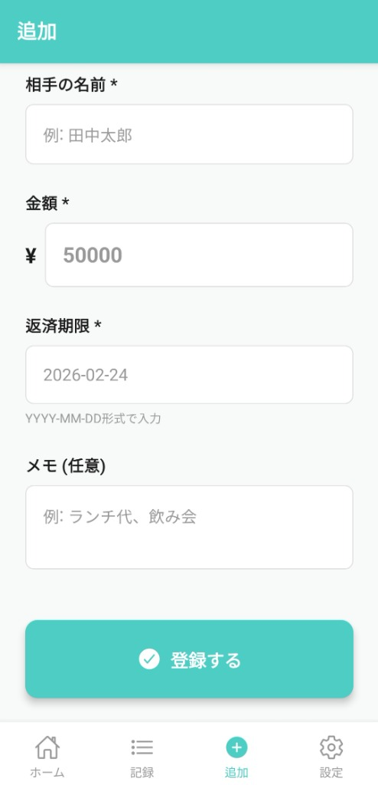
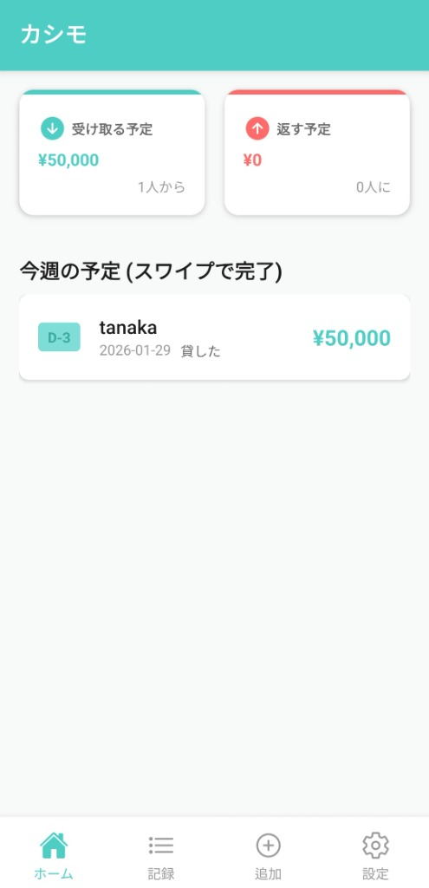
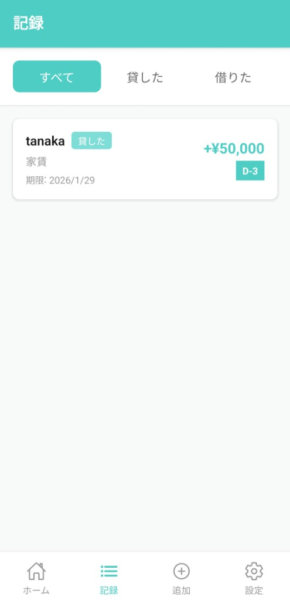

# Kashimo (カシモ)

> **友達との お金、もう忘れない**  
> (친구와의 돈, 이제 잊지 않아요)

**Kashimo**는 인터넷 연결 없이도 동작하는 **오프라인 퍼스트(Offline-First)** 개인 금전거래 관리 앱입니다.
상대방에게 앱 설치를 강요하지 않고, 나만의 기록으로 확실하게 관리하세요.

## 📱 주요 기능

### 1. 🔒 완벽한 프라이버시 (Local Database)
- 모든 데이터는 사용자의 휴대폰(SQLite)에만 저장됩니다.
- 회원가입이나 로그인이 전혀 필요 없습니다.
- 인터넷이 끊겨도 모든 기능을 100% 사용할 수 있습니다.

### 2. 💸 스마트한 거래 관리
- **빌려준 돈 / 빌린 돈**을 한눈에 파악 (Dashboard)
- 잊어버리기 쉬운 반환 기한 관리
- **부분 상환(Partial Payment)** 지원
- 거래완료 처리 및 실행 취소(Undo) 기능

### 3. 🔔 자동 리마인더
- 반환 기한에 맞춰 자동으로 알림 발송
- **알림 주기**: D-7, D-3, D-1, D-Day
- 사용자가 직접 독촉하지 않아도 앱이 알려줍니다.

### 4. 💾 데이터 안전 보관 (Backup & Restore)
- **백업**: 전체 거래 내역을 JSON 파일로 추출하여 안전하게 보관
- **복구**: 폰을 바꿔도 백업 파일을 불러와 그대로 복원 가능
- **플랫폼 지원**: Android(SAF), iOS(Share Sheet) 완벽 대응

---

## 📸 스크린샷

| Screen 1 | Screen 2 | Screen 3 |
|:---:|:---:|:---:|
|  |  |  |

*(실제 앱 구동 화면)*

---

## 🛠 기술 스택

- **Framework**: React Native (Expo SDK 52)
- **Language**: TypeScript
- **Database**: `expo-sqlite` (Local)
- **File System**: `expo-file-system` (Legacy Import)
- **Notification**: `expo-notifications` (Local Push)
- **UI Styling**: Custom Design System (No UI Library)

## 📁 프로젝트 구조

```
kashimo/
├── src/
│   ├── components/     # 재사용 가능한 UI 컴포넌트
│   ├── screens/        # 화면 (Home, Add, List, Detail, Settings)
│   ├── services/       # 비즈니스 로직
│   │   ├── database.ts    # SQLite 연동 (Core)
│   │   ├── backup.ts      # 백업/복구 (JSON)
│   │   └── notifications.ts # 푸시 알림
│   ├── constants/      # 상수 및 설정
│   └── styles/         # 디자인 토큰 (Theme)
├── assets/             # 이미지, 폰트
└── app.json            # Expo 설정
```

---

## 🚀 시작하기

### 1. 설치 및 실행

```bash
# 프로젝트 클론
git clone https://github.com/specialMinority/kashimo.git

# 의존성 설치
npm install

# 개발 서버 실행
npx expo start
```

### 2. 빌드 (Android)

*Expo EAS Build를 사용합니다.*

```bash
# Preview 빌드 (APK)
npx eas-cli build --profile preview --platform android
```

> **Note**: Android 빌드 시 `react-native-reanimated` 호환성 문제 해결을 위해 `patch-package`가 자동으로 실행됩니다.

---

## 📜 라이선스

This project is licensed under the MIT License.
