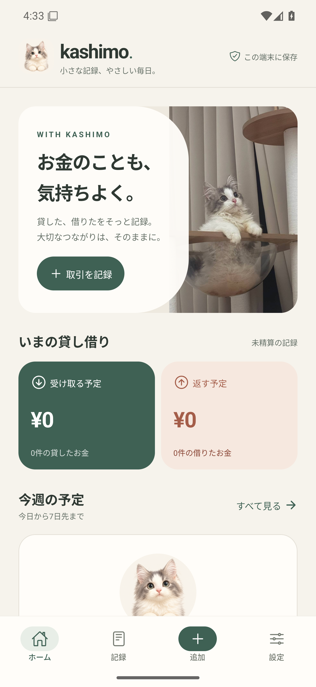
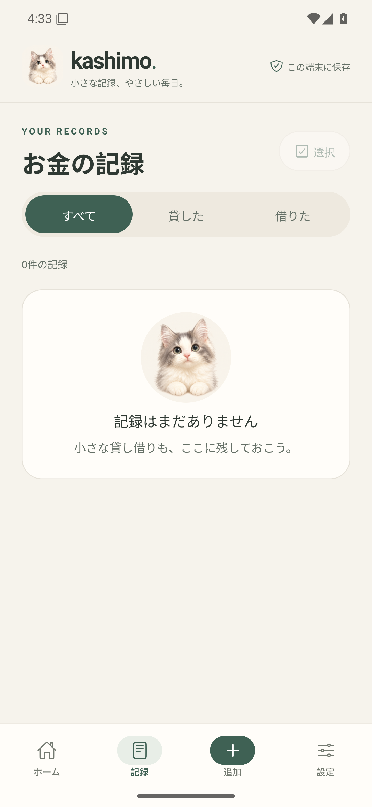
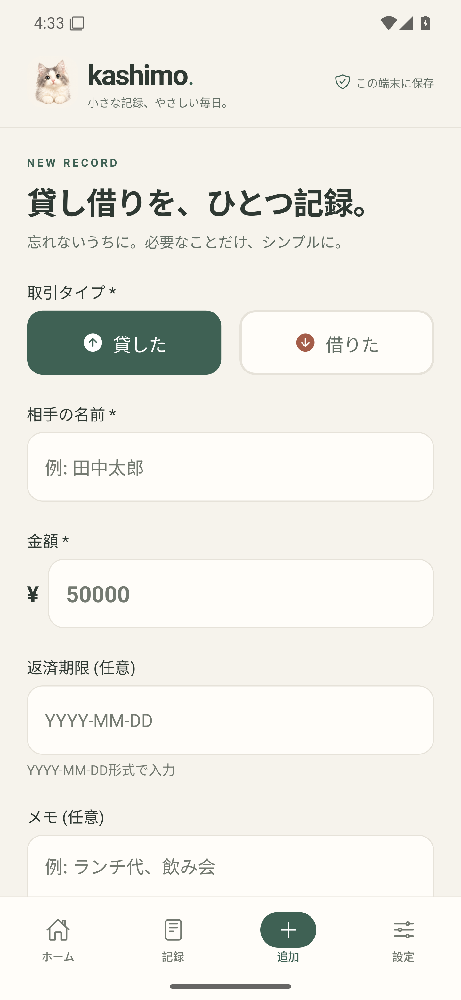
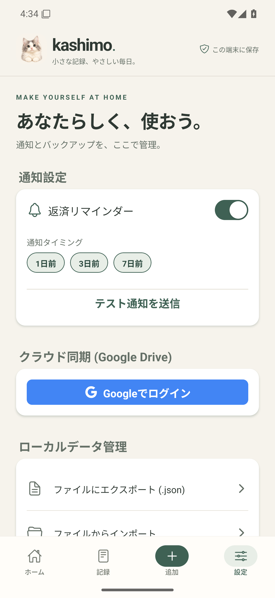
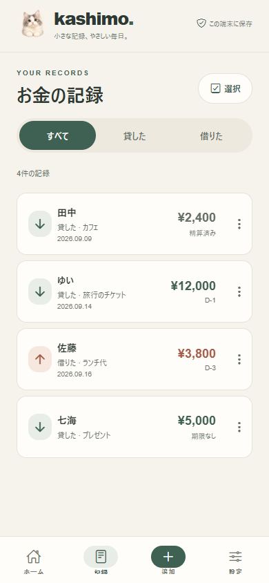
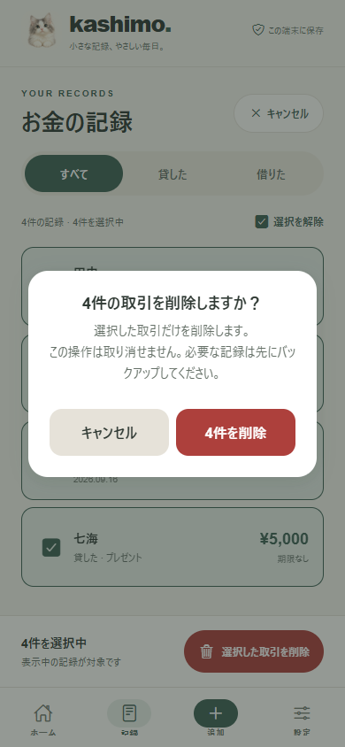

# Kashimo (カシモ)

> **友達との お金、もう忘れない**

**Kashimo**は、インターネット接続なしでも動作する**オフラインファースト(Offline-First)**の個人間金銭取引管理アプリです。
相手にアプリのインストールを強要せず、自分だけの記録で確実に管理できます。

> **ハイブリッドアーキテクチャ**:
> *   **Android**: Google Play Store (ネイティブアプリ)
> *   **iOS**: [Web PWA](https://specialminority.github.io/kashimo) (ホーム画面に追加)

## 📱 主な機能

### 1. 🔒 完全なプライバシー保護 (ローカルデータベース)
- **ネイティブ (Android)**: 高性能SQLiteローカルDBを使用
- **Web (iOS/PWA)**: LocalStorageベースのセキュアなストレージを使用
- 会員登録やログインは一切不要です。

### 2. 💸 スマートな取引管理
- **貸したお金 / 借りたお金**を一目で把握 (ダッシュボード)
- 忘れやすい返済期限の管理
- **部分返済(Partial Payment)**に対応
- 取引完了処理および取り消し(Undo)機能

### 3. 🔔 自動リマインダー
- 返済期限に合わせて自動的に通知を送信 (ネイティブのみ)
- **通知タイミング**: D-7、D-3、D-1、D-Day
- ユーザーが直接催促しなくても、アプリが自動でお知らせします。

### 4. 💾 データの安全な保管 (バックアップ & リストア)
- **バックアップ**: 全取引履歴をJSONファイルとして抽出し、安全に保管
- **リストア**: 端末を変更したり、ブラウザのキャッシュが削除されても復元可能
- **プラットフォーム別最適化**:
    - **Android**: フォルダ直接選択 (SAF)
    - **Web/iOS**: ファイルダウンロード/アップロード (Blob API)

---

## 📸 スクリーンショット

[1.1.1 Preview](https://github.com/specialMinority/kashimo/releases/tag/v1.1.1-preview) の実行画面です。下部タブのアイコン修正を反映しています。画像をクリックすると拡大できます。

### Android

Android API 35 エミュレーターで撮影した、取引登録前の画面です。

| ホーム | 記録 | 取引の登録 | 設定 |
|:---:|:---:|:---:|:---:|
| [](assets/screenshots/v1.1.1/android-home.png) | [](assets/screenshots/v1.1.1/android-list.png) | [](assets/screenshots/v1.1.1/android-add.png) | [](assets/screenshots/v1.1.1/android-settings.png) |

### Web / PWA

モバイルサイズのブラウザーで撮影した画面です。人物名・金額は説明用の架空データです。

| 取引一覧 | 一括削除の確認 |
|:---:|:---:|
| [](assets/screenshots/v1.1.1/web-list.png) | [](assets/screenshots/v1.1.1/web-bulk-delete.png) |

撮影日: 2026年9月13日（KST/JST）。[キャプチャ環境と元データ](assets/screenshots/v1.1.1/README.md)


---

## 🛠 技術スタック

- **フレームワーク**: React Native (Expo SDK 52)
- **言語**: TypeScript
- **データベース**:
    - Android: `expo-sqlite` (ネイティブSQLite)
    - Web: `localStorage` (アダプターパターン)
- **ファイルシステム**: `expo-file-system` (レガシーインポート)
- **通知**: `expo-notifications` (ローカルプッシュ)
- **デプロイ**: Play Store (Android) / **GitHub Pages** (Web PWA)

## 📁 プロジェクト構成

```
kashimo/
├── src/
│   ├── components/     # 再利用可能なUIコンポーネント
│   ├── screens/        # 画面 (Home, Add, List, Detail, Settings)
│   ├── services/       # ビジネスロジック
│   │   ├── db/            # ✅ データベースアダプター
│   │   │   ├── NativeSQLiteAdapter.native.ts
│   │   │   └── WebLocalStorageAdapter.ts
│   │   ├── database.ts    # ファサードパターン
│   │   ├── backup.native.ts
│   │   └── backup.web.ts
│   │   └── notifications.ts
│   ├── constants/      # 定数と設定
│   └── styles/         # デザイントークン (テーマ)
├── assets/             # 画像、フォント
└── app.json            # Expo設定
```

---

## 🚀 はじめ方

### 1. インストールとWeb実行 (iOS/デスクトップ)

```bash
# プロジェクトのクローン
git clone https://github.com/specialMinority/kashimo.git

# 依存関係のインストール
npm install

# Webサーバーの起動 (PWAモード)
npx expo start --web
```

### 2. ビルドとデプロイ (GitHub Pages)

```bash
# Webアプリのビルドとデプロイ
npm run deploy
```

### 3. Android実行とビルド

```bash
# 開発サーバーの起動 (Android)
npx expo start --android

# プレビュービルド (APK生成)
npx eas-cli build --profile preview --platform android
```

> **注意**: Androidビルド時、`react-native-reanimated`の互換性問題解決のため、`patch-package`が自動的に実行されます。

---

## 📜 ライセンス

このプロジェクトはMITライセンスの下でライセンスされています。
