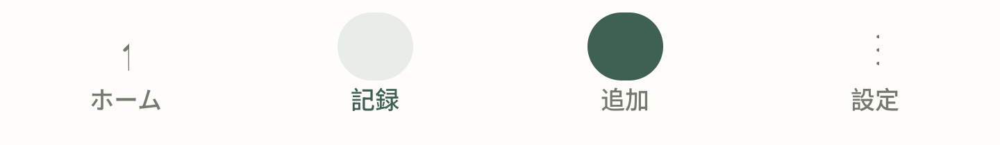
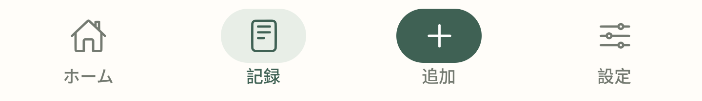
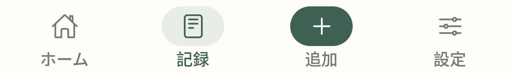

# Android 하단 아이콘 수정 — 1.1.1

2026-09-13 KST

## 사용자 보고와 원인
Android 실행 화면의 홈/설정 아이콘이 얇은 세로 조각으로 보이고, 기록/추가 아이콘은 배경만 표시되었다. 헤더·목록의 다른 아이콘은 정상이다.

React Navigation의 TabBarIcon 기본 슬롯은 31×28이다. 커스텀 View에 좌우 14px씩 여백을 추가하면서 너비를 명시하지 않아, Android Yoga가 아이콘 Text에 약 3px만 배정했다. 글꼴 파일 손상이 아니라 측정 가능한 레이아웃 폭의 문제다.

## 수정
- 바깥 tabBarIconStyle과 안쪽 배경을 모두 50×32로 지정.
- 좌우 여백 대신 alignItems/justifyContent center로 배치.
- 22px Ionicons에 24×24의 명시적인 Text 영역을 제공. Android includeFontPadding 해제, 아이콘 font scaling 비활성.
- 앱 1.1.1 / Android versionCode 2. 설정 화면도 app.json에서 버전을 읽어 일치시킨다.
- 앱 코드: `0c3c52f396d33f3fc56822b525dd2922ab589d99`.
- 이후 문서 전용 커밋은 실행 코드를 변경하지 않는다.

## 검증 기록
- TypeScript 통과.
- 저장소·알림·날짜 테스트 15개 통과.
- Chrome 통합 검증 11개 통과.
- 공개 웹 주소에서 수정된 JS index-d9bde7d6d8b8928f345f7fdde4d22787.js 로딩 확인.
- 최종 앱 소스의 Android APK 컴파일 성공.
- APK 내부 manifest: versionName 1.1.1 / versionCode 2 / com.kashimo.app / minSdk 24 / targetSdk 36.
- Android v2 서명 검증 및 이전 1.1.0 Preview APK와 인증서 바이트 일치 확인.
- ZIP CRC 전체 검사와 JS bundle·네이티브 라이브러리 포함 확인.
- APK SHA-256: `4030a78b9c0a6f9e0fd910a14d78144ac07817f6106d041252ec6cd36e2ef5ff`.
- Android API 35, 1440×3120/560dpi의 새 에뮬레이터에서 이전 APK → 새 APK install -r 업데이트 성공. 앱 삭제나 데이터 초기화 없음.
- 이전 버전 4개 탭, 수정 버전 기본 글꼴 4개 탭, 수정 버전 글꼴 1.3배 4개 탭: 총 12개 캡처와 선택 상태 확인 성공.
- 직접 이미지 검토: 이전 버전에서 사용자가 보고한 세로 조각/빈 아이콘 재현. 수정 후 모든 탭의 활성/비활성 아이콘 전체가 보이며 큰 글꼴에서도 아이콘과 라벨의 겹침·잘림 없음.
- 사용자 삼성 실기기에서 직접 설치한 결과가 아니라 격리된 Android 에뮬레이터 결과다.

## 재현 방법
`python scripts/check-android-tabs.py before.apk after.apk outputdir`

Python + Pillow, adb가 필요하다. 새 격리 에뮬레이터에서만 실행하며 실제 기기와 기존 Kashimo 설치가 있는 기기를 거부한다. 이전 APK의 네 탭 → install -r 업데이트 → 새 APK의 네 탭 → 글꼴 배율 1.3의 네 탭을 캡처한다. 거래 데이터 생성·삭제나 앱 데이터 초기화는 하지 않는다. CI 스크립트 성공과 시각적 검토 결과를 구분해 기록한다.

- [빌드·화면 검증](https://github.com/specialMinority/kashimo/actions/runs/34704926819)
- [수정 APK·소스 다운로드](https://github.com/specialMinority/kashimo/releases/tag/v1.1.1-preview)
- [웹앱](https://specialminority.github.io/kashimo/)

## 수정 전후 화면

기록 탭을 연 상태이며 실제 테스트 에뮬레이터에서 캡처했다.

수정 전:

수정 후:

수정 후 시스템 글꼴 1.3배:

## 설치
이전에 받은 1.1.0 Preview를 삭제하지 않고 1.1.1 Preview APK를 열어 업데이트 설치한다. 에뮬레이터에서 같은 서명의 install -r이 성공했고 Android versionCode가 1에서 2로 증가했다. 다른 서명으로 설치한 과거 앱과의 교체는 별도이며, 앱 제거 전에는 JSON 백업을 저장해야 한다.
